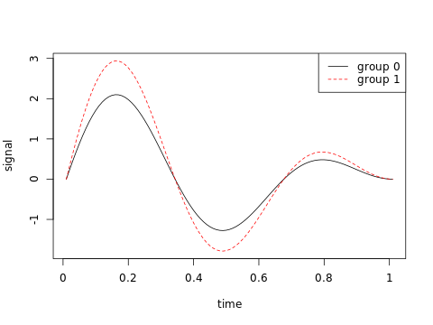

## Parallelism: Minimax Nonparametric Parallelism Test

The aim of the R package "Parallelism" is to provide a nonparametric testing approach to test whether the spatial or temporal signals in treatment and control groups are parallel or not. The power of the proposed test is minimax optimal with theoretical support.

### Installation
Install the dependent packages:
```
install.packages(c('devtools', 'gss'))
```
Install 'Parallelism' package:
```
library(devtools)
install_github("BioAlgs/Parallelism")
```

### Example
In this example, the true curve of the signals from group 0 and 1 are shown in the following figure:



We generate signals for each group with gaussian white noise and conduct the parallelsm test using the following code:


```R
library(Parallelism)
library(gss)
set.seed(123456)
n = 300
##generate locataions of the spatial or temperal points
z= seq(0,1,length.out=n)
z = c(z,z) 
##the group indictor for each mearsuement
g = c(rep(0,n),rep(1,n))
df= data.frame(g=as.factor(g),z=z)
##generate the measured signal for each group at different locations
fun1 = function(x,delta) 2.5*sin(3*pi*x[,2])*(1-x[,2])*ifelse(x[,1]==0,1,0) + ( (2.5+delta)*sin(3*pi*x[,2])*(1-x[,2]) )*ifelse(x[,1]==0,0,1)
y = fun1(df, 1) + rnorm(2*n,0, 1)

# plot(y[1:n])
# poin
##begin the test
res = parallelism(y,z,as.factor(g))
```

Testing Result:
```
begin model fitting...
begin testing...
the test complete.
p-value=1.36323458389081e-06
```

### Usage 
```
parallelism(y = y, z = z, g = g)
     
Arguments:

       y: the input signal.

       z: the spatial or tempral locations (scaled to [0,1]).

       g: the categorical variable representing the group information.

Value:

     score: the value of the test statisitcs.

     pvalue: P-value of the test.
```