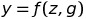
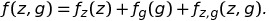
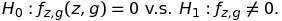

## Parallelism: Minimax Nonparametric Parallelism Test

The aim of the sstest is to test whether the signal change along the spatial or temperal domain differently in different group. In general, we model the signal y as an function of spatial or temperal location z and group indicator g as 



Through the functional ANOVA decompostion, we have



where the first term is the spatial or temperal effect, the second term is the group effect and the third term is the interaction effect between them. Our hypothesis test is 




### Installation


### Example
In this example, we generate two signals from two groups with the patterns. The true curve of the signals from group 0 and 1 are shown in the following figure:


We generate 200 signals for each group with gaussian white noise and doing the sstest using the following code:


```R
library(sstest)
n = 200
##generate data
z= seq(0,1,length.out=n)
z = c(z,z) 
g = c(rep(0,n),rep(1,n))
df = data.frame(g=as.factor(g), z=z)
 
fun1 = function(x,delta) 2.5*sin(3*pi*x[,2])*(1-x[,2])*ifelse(x[,1]==0,1,0) + ( (2.5+delta)*sin(3*pi*x[,2])*(1-x[,2]) )*ifelse(x[,1]==0,0,1)
y = fun1(df, 0.5) + rnorm(2*n)
 
##begin the test
res = sstest(y,z,g)
```


